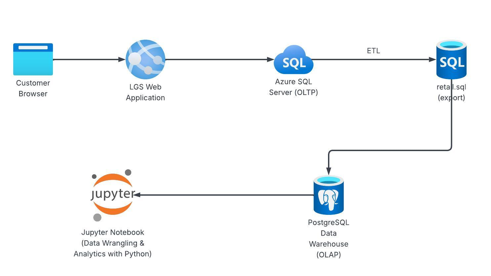

# Introduction
London Gift Shop (LGS) is a UK-based online retailer specializing in giftware, serving both individual customers and 
a large base of wholesalers. Although the company has operated online for over a decade, its revenue hasn't been growing.
To address this, the LGS marketing team wants to leverage data-driven insights to better understand customer purchasing
behaviour and design more effective marketing strategies.

LGS partnered with Jarvis Consulting to build a proof of concept (PoC) analytics solution. As a Data Engineer on the
Jarvis team, my role is to analyze historical transactional data to extract patterns that can help LGS increase revenue,
retain existing customers, and target new segments more effectively. Insights from this analysis,such as seasonality,
product performance, customer segmentation, and cancellation patterns, will guide LGS in creating targeted campaigns, 
optimizing inventory, and improving overall operational decisions.

This PoC was implemented using **Python** with **Pandas**, **NumPy**, and **Matplotlib** in a **Jupyter Notebook**, focusing on data wrangling, 
exploratory analysis and visualization to generate business-driven insights.
# Implementaion
## Project Architecture
The PoC architecture follows a simple, cloud-inspired pipeline adapted to the constraints of the project.
Since the Jarvis team cannot operate in LGS's Azure environment, the IT team exported two years of historical transactional
data as a SQL dump. This dataset acts as the source for all further processing.

The architecture consists of:
1. **Data Source (LGS online store):** LGS web application continuously stores order, product, pricing, and customer 
    activity data in a transactional database.
2. **Data Export(SQL File):** To support this PoC, the LGS IT team provided an anonymized SQL export (retail.sql)
   containing all transactions between December 2009 and December 2011. 
3. **Local PostgreSQL Database (Docker):** The SQL file is ingested into a PostgreSQL instance running locally via Docker.
4. **Data Wrangling & Analytics (Python / Jupyter Notebook):** Using python libraries such as Pandas and Numpy, the
    data is cleaned, transformed, and analyzed to answer business questions such as
   - Customer purchasing behavior
   - seasonal trends
   - new vs existing customers activity
   - cancellation analysis
   - etc.
   
5. **Deployment (Notebook+Github):** 
   London Gift Shop (LGS) is a UK-based online retailer specializing in giftware, serving both individual customers and
   a large base of wholesalers. Although the company has operated online for over a decade, its revenue hasn't been growing.
   To address this, the LGS marketing team wants to leverage data-driven insights to better understand customer purchasing
   behaviour and design more effective marketing strategies.

# Implementaion
## Project Architecture
The PoC architecture follows a simple, cloud-inspired pipeline adapted to the constraints of the project.
Since the Jarvis team cannot operate in LGS's Azure environment, the IT team exported two years of historical transactional
data as a SQL file. This dataset acts as the source for all further processing.

The architecture consists of:
1. **Data Source (LGS online store):** LGS web application continuously stores order, product, pricing, and customer
   activity data in a transactional database.
2. **Data Export(SQL File):** To support this PoC, the LGS IT team provided an anonymized SQL export (retail.sql)
   containing all transactions between December 2009 and December 2011.
3. **Local PostgreSQL Database (Docker):** The SQL file is ingested into a PostgreSQL instance running locally via Docker.
4. **Data Wrangling & Analytics (Python / Jupyter Notebook):** Using python libraries such as Pandas, Numpy and Matplotlib. The data is cleaned, transformed, and analyzed to answer business questions such as
    - Customer purchasing behavior
    - seasonal trends
    - new vs existing customers activity
    - cancellation analysis
    - etc

5. **Deployment (Notebook+Github):** The final deliverable to LGS is a Jupyter Notebook hosted in a GitHub repository, 
including visualizations and business recommendations.

### Architecture Diagram

## Data Analytics and Wrangling
-  link to the Jupyter notebook: https://github.com/jarviscanada/jarvis_data_eng_KantyGakima/blob/feature/data_analytics/python_data_analytics/retail_data_analytics_wrangling.ipynb

### How the Analytics can help LGS increase Revenue
Here are few recommendations that can help increase revenue based on the insights extracted from the data.
1. Targeted Marketing for New and Existing Customers
   - Identify first-time buyers and design onboarding campaigns
   - Reward high-frequency repeat customers with personalized promotions
2. Cancellation Reduction
   - Analyze cancellation patterns to identify the cause and how to reduce them.
   - Implement corrective measures such as stock validation or checkout optimizations
3. Revenue Forecasting and Trend Analysis
   - Monthly and yearly purchasing trends help forecast revenue fluctuations
   - Seasonal campaigns (Christmas, summer, etc.) can be optimized with historical data

LGS can also use **RFM(Recency, Frequency, Monetary) segmentation**, to understand customer loyalty, identify high-value customers, and design
targeted marketing campaigns.

Customers are grouped based on their RecencyScore and FrequencyScore, using a simplified mapping from the notebook
Below are key segments, their meaning and how they can use for marketing strategies :
#### Segment Overview (Based on LGS Dataset)
- Can,t Lose: 85 customers
- Hibernating: 1,535 customers
- Champions: 856 customers
#### Segment insights
1. **Can't Lose**
   - Recency: ~5,434
   - Frequency: ~17
   - Monetary: ~£5,726 \
   These customers were previously very active and high-spending but have not purchased in a long time. They are 
   high-risk but high-value. LGS should prioritize personalized reactivation campaigns, including targeted offers based
   on past purchases, and investigate factors contributing to their inactivity. 
2. **Hibernating**
   - Recency: ~5,578
   - Frequency: ~1
   - Monetary: ~£340 \
   These customers have been inactive the longest and generally made only one purchase. They represent low-engagement
   customers who may respond to broad promotional campaigns such as seasonal discounts or store-wide deals.
3. **Champions**
   - Recency: ~5,120
   - Frequency: ~24
   - Monetary: ~£10,511
   Champions are the most valuable customers, purchasing often and spending significantly. LGS should focus on retention
   strategies such as loyalty rewards, exclusive previews, and personalized recommendations ensuring continued engagement and satisfaction.

# Improvements
- **Enhance data cleaning and validation:** In the current project, I verify data types and detect invalid records manually,
    which is time-consuming and does not guarantee full data integrity. A future improvement would be to automate these checks 
    using a script or reusable function that flags anomalies and quality issues before the analysis begins.
- **Expand the analysis to include product-level insights:** The existing analysis is primarily focused on customer behaviour.
    to provide a more complete view of revenue drivers, I would add product-level exploration and visualizations?such as top-selling items,
    underperforming products, seasonal product trends, and SKU-level cancellations.
- **Automate RFM segmentation:** Since RFM segmentation can be reused across different datasets and businesses, 
    a valuable improvement would be to build a reusable Python class or function that automatically computes RFM metrics, scores, and segment labels.
